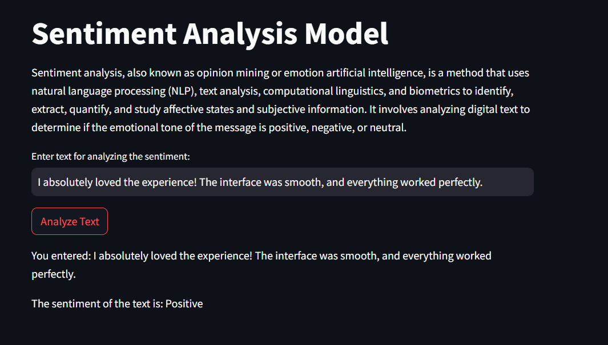

# Sentiment Analysis Project

A beginner-friendly Python project that performs **sentiment analysis** on text data using machine learning techniques. This project covers text preprocessing, sentiment classification, and visualization of results. It’s ideal for anyone starting out with Natural Language Processing (NLP) and machine learning.

---

## Project Overview

Sentiment analysis helps determine the sentiment or emotion behind a piece of text — classifying it as positive, negative, or neutral. This project implements this using Python and common NLP libraries, focusing on clarity and simplicity.

---

## Features

- Text preprocessing (cleaning, tokenization, etc.)
- Sentiment classification (positive, negative, neutral)
- Visualizations for sentiment distribution and insights
- Easy-to-understand code for beginners

---

## Technologies Used

- Python 3.x  
- Libraries: `pandas`, `numpy`, `scikit-learn`, `matplotlib`, `seaborn`, `nltk`

---

## How to Run

1. Clone this repository:

   ```bash
   git clone https://github.com/yourusername/sentiment-analysis.git

2. Navigate into the project directory:

   ```bash
   cd sentiment-analysis
3. Install the required dependencies:

   ```bash
   pip install -r requirements.txt

4. Run the main script or open the notebook:
   ```bash
   python sentiment_analysis.py

## Folder Structure
├── screenshots/ # Screenshots for README UI section
│ ├── startup_ui.png
│ ├── input_positive.png
│ └── input_negative.png
├── sentiment_analysis.py # Main script
├── requirements.txt # Required Python libraries
├── README.md # Project documentation

## UI

---

### At the Startup:


---

### After Entering Input

**Example 1: Positive Sentiment**



**Example 2: Negative Sentiment**


## Future Improvements
1.Add deep learning models such as LSTM or Transformer-based models

2.Support multilingual sentiment analysis

3.Enhance preprocessing with advanced NLP techniques

##Author
Stuti
